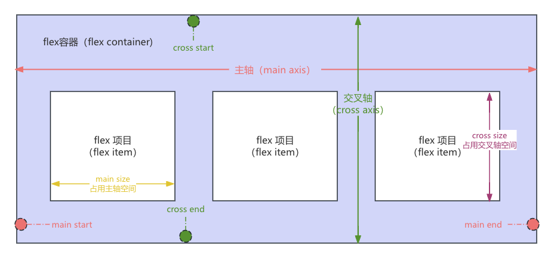
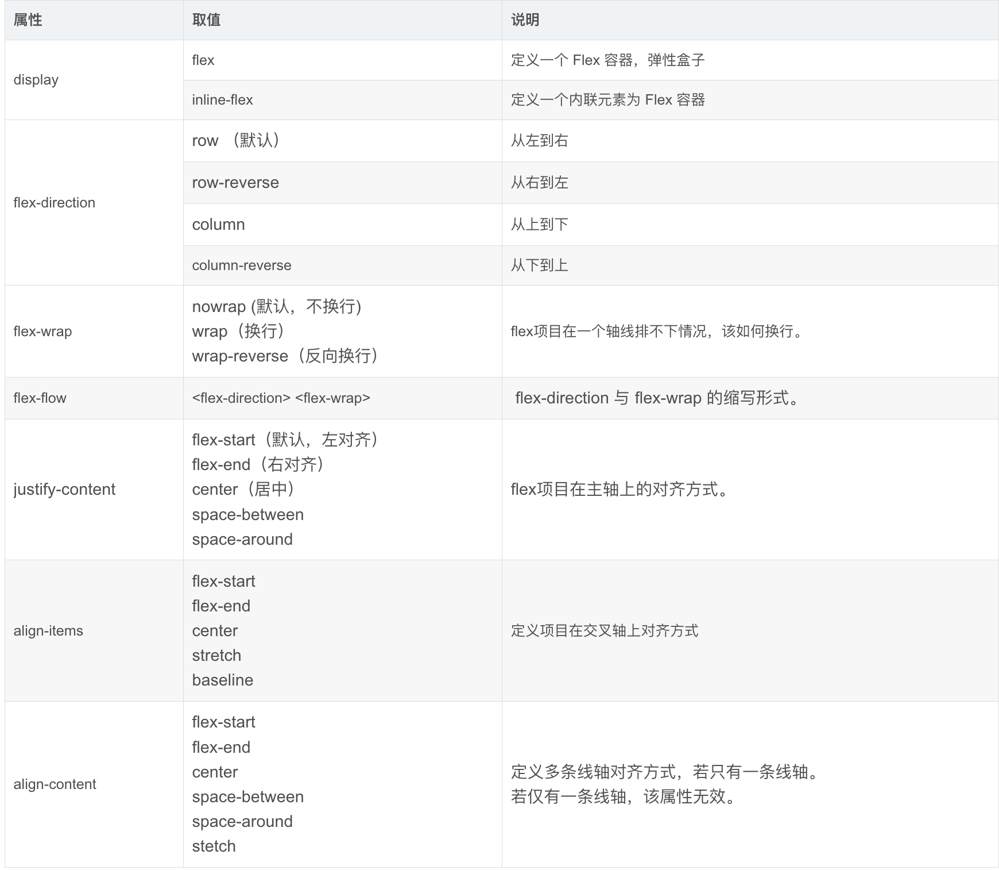
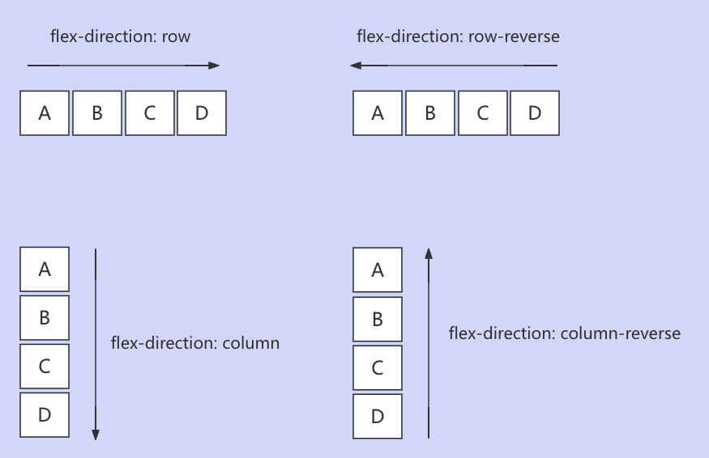
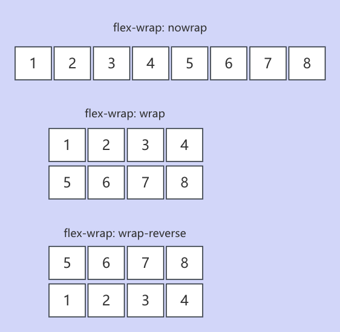
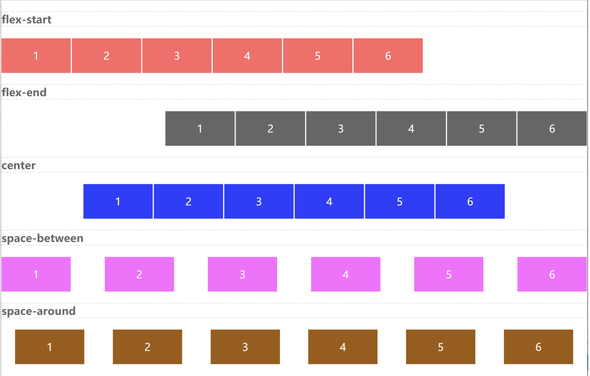
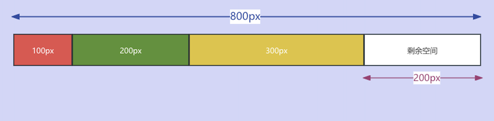
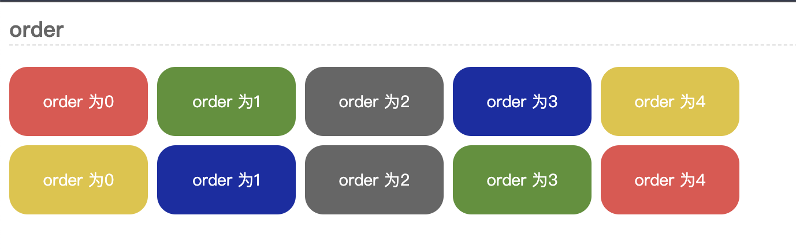
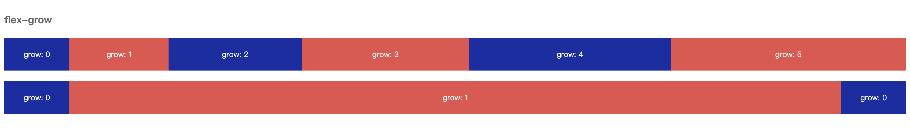
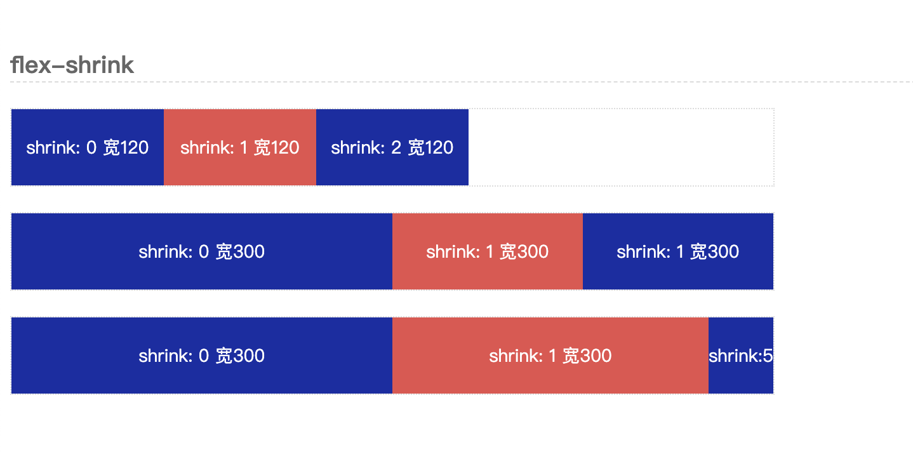
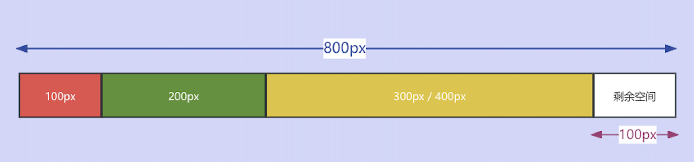

## HTML 相关
## CSS 相关
## 1. 实现一个上中下三行布局，顶部和底部最小高度是 100px，中间自适应
```html
<div class="container">
  <div class="header">Header</div>
  <div class="main">Main</div>
  <div class="footer">Footer</div>
</div>
```
```css
.container {
  display: flex;
  flex-direction: column;
  height: 100vh;
}

.header,
.footer {
  min-height: 100px;
  background-color: #ccc;
}

.main {
  flex: 1;
  background-color: #f0f0f0;
}
```
## 2. 不定宽高元素水平垂直居中
```css
.container {
  display: flex;
  justify-content: center;
  align-items: center;
}
```
## 3. Flex 布局的基本概念和主要属性
Flex布局是一种现代的前端布局模式，它用于在复杂的布局中轻松地对齐、分布和排序空间，特别是当屏幕大小或布局方向动态变化的场景。
#### 基本概念
1.  容器/项目<br/>
    使用 Flex 布局的元素（display: flex），称之为 Flex 容器（Flex Container），简称 "容器"。Flex 的布局发生在父容器和子容器之间，因此，元素一旦被申明为 Flex 布局后，它的所有子元素自动成为容器成员。通常，我们将容器内的成员统称为 Flex 项目（Flex item），简称 "项目"。

2.  主轴、交叉轴<br/>
    容器中默认存在两条线轴，即：主轴（main axis）、交叉轴（cross axis）。主轴与交叉轴是垂直关系，值得注意的是主轴不一定是水平方向，而是由 flex-direction 属性所决定的。
    * main axis：主轴。
    * cross axis：交叉轴。

3.  轴线起始位置<br/>
    主轴和交叉轴的起始位置，分别称为：main start、main end、cross start、cross end。
    * main start：主轴开始位置
    * main end：主轴结束位置
    * cross start：交叉轴开始位置
    * cross ennd：交叉轴结束位置

4.  主轴、交叉轴空间<br/>
    项目（flex item）默认是沿主轴方向排列的，单个项目占据主轴的空间称之为 main size，占据交叉轴的空间称之为 cross size
    * main size：占据主轴的空间
    * cross size：占据交叉轴的空间

基本概念间的相互关系如下图所示：
概念间的相互关系如下图所示：


#### 容器、项目属性
1. 容器属性

下表展示了容器的属性和取值。


* flex-direction 属性，定义了在哪个方向上排列项目。flex-direction有四个取值，分别为：
  
| 取值 | 说明 |
| :---- | :----  |
| row | 从左到右（默认） |
| row-reverse | 从右到左 |
| column | 从上到下。 |
| column-reverse | 从下到上 |

属性实例如下图所示：


* flex-wrap 属性，定义了项目在轴线上的排列方式，在默认情况下，项目都排列在一条线上，不会换行，可以通过 flex-wrap 来定义换行的方式。flex-wrap 有三个取值，分别为：

| 取值 | 说明 |
| :---- | :----  |
| nowrap | 不换行（默认） |
| wrap | 换行，第一行在上方 |
| wrap-reverse | 换行，第一行在下方 |

属性实例如下图所示：


* flex-flow 属性，是 flex-direction 属性和 flex-wrap 属性的简写形式，默认值为 row nowrap。

语法：flex-flow: flex-direction flex-wrap;

例子：

flex-flow: row nowrap （默认值，项目沿着主轴排列，不换行。）

flex-flow: column  wrap-reverse（项目沿着交叉轴排列，反向换行）

* justify-content 属性，定义了项目在主轴上的对齐方式，justify-content 有五个取值，分别为：

| 取值 | 说明 |
| :---- | :----  |
| flex-start | 左对齐 |
| flex-end | 右对齐 |
| center | 居中对齐 |
| space-between | 两端对齐，项目之间的间隔相等 |
| space-around | 每个项目两侧的间隔相等，所以项目之间的间隔比项目与边框的间隔大一倍 |

属性实例如下图所示：


> space-between 会使项目两端对齐，并且项目之间的间距相同。space-around 同样会是项目的间距相同，不同之处是与两端也会有间距。且项目与项目之间的距离是两端间距的2倍，可以理解为：margin-left、margn-right 设置了相同的值。

* align-items 属性，定义了项目在交叉轴上的对齐方式，align-items 有五个取值，分别为：

| 取值 | 说明 |
| :---- | :----  |
| flex-start | 顶部对齐 |
| flex-end | 底部对齐 |
| center | 居中对齐 |
| baseline | 以项目中第一行文字基线对齐 |
| stretch | 默认值，如果项目未设置高度或设为auto，将占满整个容器的高度 |

* align-content 属性，定义了多根轴线的对齐方式，如果项目只有一根轴线，该属性不起作用，align-content 有六个取值，分别为：

| 取值 | 说明 |
| :---- | :----  |
| flex-start | 与交叉轴起点对齐 |
| flex-end | 与交叉轴终点对齐 |
| center | 在交叉轴上居中对齐 |
| space-between | 与交叉轴两端对齐，轴线之间的间隔平均分布 |
| space-around | 轴线之间的间隔平均分布，包括两端 |
| stretch | 默认值，轴线占满交叉轴 |

2. 项目属性<br/>
下表展示了项目的属性和取值。<br/>

| 属性 | 默认值 | 说明 |
| :---- | :---- | :---- |
| order | 0 | 定义项目的排列顺序，数值越小，排列越靠前，默认为0 |
| flex-grow |  0 | 定义项目的放大比例，默认为0，即如果存在剩余空间，也不放大 |
| flex-shrink | 1 | 定义项目的缩小比例，默认为1，即如果空间不足，该项目将缩小 |
| flex-basis | auto | 定义了在分配多余空间之前，项目占据的主轴空间（main size）。浏览器根据这个属性，计算主轴是否有多余空间 |
| flex | 0 1 auto | flex-grow, flex-shrink 和 flex-basis 的简写，默认值为 0 1 auto。后两个属性可选。 |
| align-self | auto | 允许单个项目有与其他项目不一样的对齐方式，可覆盖 align-items 属性。默认值为 auto，表示继承父元素的 align-items 属性，如果没有父元素，则等同于 stretch。 |

在学习这些具体的项目属性之前，我们需要先了解一个非常重要的概念 — 剩余空间。
如下图所示，将父容器的宽度设置为 800px，容器中3个项目宽度分别为100px、200px、300px。


那么，剩余空间就是：
> 200px = 800px - (100px + 200px + 300px)

而 flex-grow、flex-shrink 和 flex-basis 都是围绕如何分配剩余空间展开的。
* order 属性定义项目的排列顺序，数值越小，排列越靠前，默认为0。
```css
.item { order: <integer> }
```
如下图所示：


* flex-grow 属性定义项目的放大比例，默认为0，即如果存在剩余空间，也不放大。
```css
.item { flex-grow: <number> }
```
如下图所示：

* flex-shrink 属性定义了项目的缩小比例，默认为1，即如果空间不足，该项目将缩小。
```css
.item { flex-shrink: <number> }
```
如下图所示：

* flex-basis 属性定义了在分配多余空间之前，项目占据的主轴空间（main size）。浏览器根据这个属性，计算主轴是否有多余空间。
```css
css
.item { flex-basis: <length> | auto }
```
如下图所示：
理解这段话的重点两个字就是 "之前"。

我们将 3个 item 宽度分别设置为 100px、200px、300px，并且将第3个项目的 flex-basis 设置为 400px。可以看出，效果如下图所示。


* flex 属性是 flex-grow、flex-shrink 和 flex-basis 的简写，默认值为 0 1 auto。后两个属性可选。
```css
.item { flex: <flex-grow> <flex-shrink> <flex-basis> }
```
* align-self 属性允许单个项目有与其他项目不一样的对齐方式，可覆盖 align-items 属性。默认值为 auto，表示继承父元素的 align-items 属性，如果没有父元素，则等同于 stretch。
```css
.item { align-self: auto | flex-start | flex-end | center | baseline | stretch; }
```
align-self 有 6 个可能值，除了 auto（继承父元素的 align-items 属性），其他都与 align-items 的取值相同。
| 取值 | 说明 |
| :---- | :----  |
| auto | 继承父元素的 align-items 属性 |
| flex-start | 与交叉轴的起点对齐 |
| flex-end | 与交叉轴的终点对齐 |
| center | 在交叉轴上居中对齐 |
| baseline | 以项目中第一行文字基线对齐 |
| stretch | 默认值，如果项目未设置高度或设为auto，将占满整个容器的高度 |

## JavaScript 相关
## TypeScript 相关
## Vue 相关
## Webpack 相关
## Vite 相关
## Node 相关
## Git 相关
## HTTP 相关
## 浏览器相关
## 微前端相关
## 前端工程化
## 部署相关
## 性能优化
## 安全相关
## 项目相关
## 算法
## 其它
### 1. 通知用户版本更新刷新页面

在每次打包生产代码时，在 public 目录下生成一个 version.json 版本信息文件，页面跳转时请求服务器端的 version.json 中的版本号和浏览器本地缓存的版本号进行对比，从而监控版本迭代更新，实现页面自动更新，获取新的 index.html 文件（前提是服务器端对 index.html 和 version.json 不缓存）。

1. 首先应该禁止浏览器缓存 index.html 和 version.json
```conf
location /index.html {
    add_header Cache-Control "no-cache, no-store, must-revalidate";
    add_header Pragma "no-cache";
    add_header Expires 0;
}
location /version.json {
    add_header Cache-Control "no-cache, no-store, must-revalidate";
    add_header Pragma "no-cache";
    add_header Expires 0;
}
```
2. 编写 Vite 插件实现打包时自动生成版本信息
新建文件 src/plugins/versionUpdatePlugin.ts
```ts
// src/plugins/versionUpdatePlugin.ts
import fs from "node:fs";
import path from "node:path";

import type { ResolvedConfig } from "vite";

function writeVersion(versionFile: string, content: string) {
  // 写入文件
  fs.writeFile(versionFile, content, (err) => {
    if (err) throw err;
  });
}

export default (version: string | number) => {
  let config: ResolvedConfig;
  return {
    name: "version-update",
    configResolved(resolvedConfig: ResolvedConfig) {
      // 存储最终解析的配置
      config = resolvedConfig;
    },
    buildStart() {
      // 生成版本信息文件路径
      const file = config.publicDir + path.sep + "version.json";
      // 这里使用编译时间作为版本信息
      const content = JSON.stringify({ version });
      if (fs.existsSync(config.publicDir)) {
        writeVersion(file, content);
      } else {
        fs.mkdir(config.publicDir, (err) => {
          if (err) throw err;
          writeVersion(file, content);
        });
      }
    },
  };
};
```
3. 在 vite.config.ts 中使用插件
对于使用 TypeScript 的开发者来说，请确保在 env.d.ts 或 vite-env.d.ts 文件中添加类型声明，以获得类型检查以及代码提示。
```ts
// vite-env.d.ts
declare const __APP_VERSION__: string
```
配置 vite.config.js
```ts
import versionUpdatePlugin from "./src/plugins/versionUpdatePlugin";

export default defineConfig(({ mode }) => {
    ...
    const now = new Date().getTime();
    return {
        ...
        define: {
        __APP_VERSION__: now,
        },
        plugins: [
        vue(),
        versionUpdatePlugin({
            version: now,
        }),
        ],
        ...
    };
});
```
4. 路由跳转时，实时检测版本
检测到新版本自动刷新页面，应该使用前置守卫，在跳转失败报错前检测，跳转失败不会触发后置守卫
```ts
// router/index.ts
import { Modal } from "ant-design-vue";
...
// 这里在路由全局前置守卫中检查版本
router.beforeEach(async () => {
  console.log("路由守卫");
  await versionCheck();
});

// 版本监控
const versionCheck = async () => {
  // if (import.meta.env.MODE === "development") return;
  // const response = await axios.get("version.json");
  const responseVersion = 1721114748501;
  // __APP_VERSION__  获取环境变量设置的值，判断是否与生成的版本信息一致
  console.log("__APP_VERSION__", __APP_VERSION__);
  if (__APP_VERSION__ !== responseVersion) {
    Modal.confirm({
      title: "版本更新提示",
      content: "检测到新版本，更新之后将能体验到更多好用的功能，是否现在更新？",
      onOk() {
        window.location.reload();
      },
      onCancel() {},
    });
  }
};
...
```

## 面试技巧
