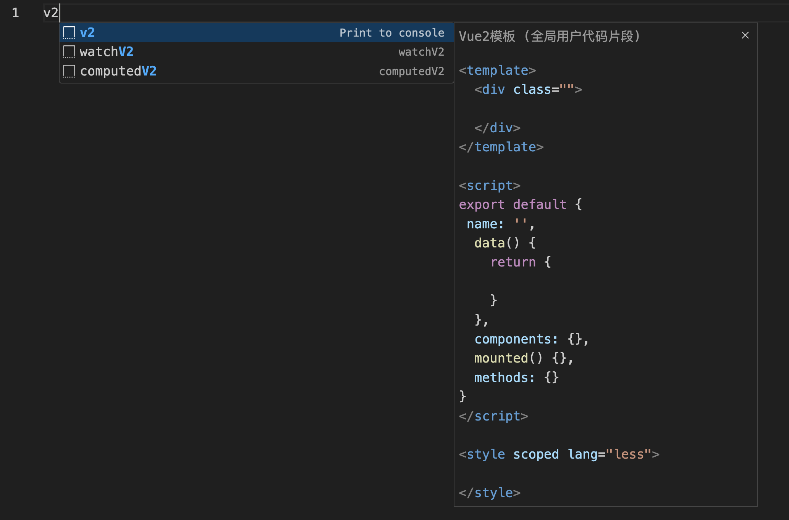

## 前沿技术

## VScode 外观配置
### 1. 主题推荐
*  ONE DARK PRO

是一款深色主题，深受许多开发者的青睐，它的色彩搭配源自 Atom 编辑器的 One Dark 主题，特点是对眼睛友好和高对比度的语法高亮。
* DRACULA
  
Dracula 是一款以其独特的紫色调和柔和对比度著称的主题，这款主题在视觉上既具有吸引力又不过度刺激，这得益于它的暗色背景和温和的前景颜色搭配。
* MATERIAL THEME
  
Material Theme 是受 Google 的 Material Design 设计语言启发的 VS Code 主题，它以简洁的设计和优雅的色彩搭配著称，为用户提供了一系列不同的颜色方案。
### 2. 文件图标
* Material Icon Theme

Material Icon Theme 是 VSCode 中最受欢迎的文件图标主题，采用了谷歌的 Material 设计风格。其特点是图标非常的丰富，而且辨识度很高，色彩丰富，让人看了非常愉悦。除了丰富的文件图标之外，Material Icon Theme 还有丰富的文件夹图标，这也是我非常喜欢的一点。文件夹会根据名称变换图标，方便快速定位需要的文件夹，也可以作为文件夹名称拼写错误的提醒。
* Material Theme Icons
  
这个主题的名字和上一个主题很像，只是调换了后两个单词的位置，但实际上是两个完全不同的插件。虽然都是基于 Material 风格的，但 Material Theme Icons 的色调更浅，风格也更加卡通化。其文件夹图标相对来说也没有第一个主题丰富。
* VSCode Icons
  
VSCode Icons 的受欢迎程度仅次于最开始介绍的 Material Icon Theme，其文件图标同样非常丰富，而且也有丰富的文件夹图标，对于文件的识别有很大的帮助。这款文件图标主题还支持图标自定义和自定义图标的导入。

### 3.安装/应用主题或图标主题
只需打开 VS Code，然后进入扩展市场搜索特定的主题，点击安装。
点击左下角的设置，选择 主题（Themes），点击 颜色主题（Color Theme ）/文件图标主题（File Icon Theme），就会弹出菜单选择和预览安装的主题，最后应用即可。在试用不同主题时，可以注意到主题对不同编程语言的支持或高亮差异，进一步根据编程习惯进行选择。

## VScode 代码片段
项目开发过程中，总会遇到一些复用的代码，创建vue 组件时的基本配置等，就可以设置代码片段，在使用的时候通过前缀调用，配置方法如下：
只需打开 VS Code，点击左下角的设置，选择 用户代码片段（Themes），就会弹出菜单选择新建全局代码片段文件，然后输入代码片段文件名，在配置项中增加你要添加的 片段内容即可。例如 添加 vue2 模板代码片段
```json
{
    "Print to console": {
      "prefix": "v2",
      "body": [
        "<template>",
        "  <div class=\"\">",
        "    $1",
        "  </div>",
        "</template>\n",
        "<script>",
        "export default {",
        " name: '',",
        "  data() {",
        "    return {\n",
        "    }",
        "  },",
        "  components: {},",
        "  mounted() {},",
        "  methods: {}",
        "}",
        "</script>\n",
        "<style scoped lang=\"less\">\n",
        "</style>",
        "$0"
      ],
      "description": "Vue2模板"
    }
}
```
在需要使用时 只需 键入对应代码片段的 `prefix`，然后点击 tab 即可。


## VScode 插件推荐
### Git Graph
创建项目分支的可视化地图并直接在 VS Code 内提交。其可视化表示可帮助你遵循开发路径，显示分支从何处开始、在何处合并以及何时发生提交。
### Git History
可以查看 Git 历史记录，包括提交、分支和文件。它还支持在 VS Code 中比较两个版本，并显示差异。
### GitLens
可以轻松查看谁使用 Git Blame 注释和代码镜头编写了代码，轻松导航 Git 存储库，有效比较代码并获得有价值的见解。
### Path Intellisense
会在键入时建议文件路径，可以确保快速找到正确的路径并减少错误
### Prettier
会自动格式化您的代码，从而简化维护一致代码库的过程。
### Eslint
ESLint是一种广泛使用的扩展，可以发现代码中的错误和错误，从而使编码变得更好。它通过显示可能出现错误或警告的位置来帮助您避免错误。
### Code Spell Checker
拼写错误检查，当我们编写代码时，偶尔会出现单词拼错的情况，这个插件可以检查到可能拼写错误的单词，并有波浪线提醒。
### Regex Previewer
可以实时测试和调试正则表达式模式，确保准确匹配。此扩展允许在编辑器中快速迭代和优化正则表达式，从而节省时间。
### Markdown All in One
是 Markdown 文件的完整 VS Code 扩展。它通过快捷方式、格式设置等各种功能使创建和编辑 Markdown 变得容易。
### Markdown PDF
可以将 markdown 导出为各种格式的文件。
### TODO Highlight
可以帮助开发者在编辑器中突出显示代码中的 TODO、FIXME、NOTE 等注释，方便快速定位和管理待办事项。
### indent-rainbow
彩虹缩进，当我们的代码嵌套结构比较复杂后，它可以帮助我们对锁紧进行对其检查。每个缩进都有不同的交替彩虹色。
### colorize
将代码中的颜色添加到 VS Code 中，以帮助您更好地理解代码，支持 CSS、Javascript。

## 好用网站
#### utools
地址：https://u.tools/
是一款极简、插件化、跨平台的插件合集软件，同时也是一款应用搜索工具，软件界面风格简约、软件功能实用，通过自由选配丰富的插件，打造你得心应手的工具集合。
#### processon
地址：https://www.processon.com/
是一个方便易用、免费高效的在线作图工具，运用它可以免费制作多种图。
#### CSS Grid Generator
地址：https://cssgrid-generator.netlify.app/
能够一键生成网格布局，当遇到网格布局不好划分的时候我们可以使用这个网址。
#### xclient
地址：https://xclient.info/
是一个 Mac软件下载网站，里面有各种软件，并且可以进行软件搜索。