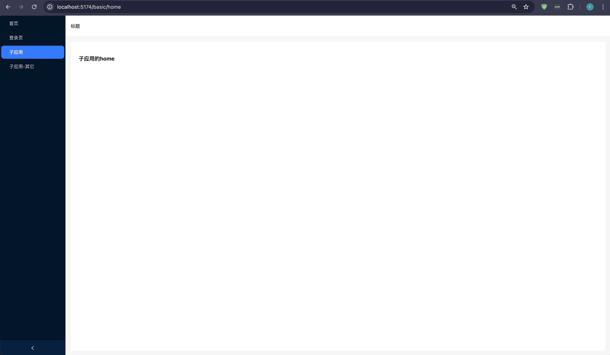

微前端是一种通过独立发布功能的方式，让多个团队共同构建现代化web应用的技术手段及方法策略。`qiankun`（乾坤）是一个基于 `single-spa` 的微前端实现库，旨在帮助开发者更简单、无痛地构建一个生产可用的微前端架构系统。

`qiankun` 的核心设计理念在于其技术栈无关性，无论是主应用还是微应用，都可以做到技术栈的无关，这使得开发者在使用 `qiankun` 时具有较大的灵活性。此外，`qiankun` 还提供了简单的API供开发者调用，使得微前端的改造变得相对容易。

## 应用场景

* 多项目整合：在企业中，经常需要将多个独立的项目整合在一起进行协同开发和部署。使用 `qiankun` 框架可以轻松实现多项目之间的数据共享和页面整合，从而提高开发效率。

* 前后端分离：随着前后端分离的流行，前端的职责越来越重，需要独立维护自己的代码和部署环境。`qiankun` 框架可以将前端开发成独立的微服务，从而简化部署和维护工作。

* 动态加载：`qiankun` 框架支持动态加载，即在运行时可以根据需要动态加载模块和组件，实现应用的按需组装和部署。这个特性在大型应用中非常有用，能够优化应用的性能和加载速度。

总的来说，`qiankun` 框架是一个功能强大且易于使用的微前端解决方案，它能够帮助开发者更好地管理和组织复杂的项目，提高开发效率和应用的性能。

## 示例代码
根据 Vue3+Ts+Vite+Qiankun 快速搭建一个微前端项目，整体效果如下图所示：


__具体步骤如下：__

### 1. 初始化项目

使用 `Vite` 创建两个新的 Vue 3 + TypeScript 项目分别作为主应用和子应用：

创建主应用
```bash
npm init vite@latest main --template vue-ts
cd main
npm install
```
创建子应用
```bash
npm init vite@latest basic --template vue-ts
cd basic
npm install
```

这里为了页面美观，还引入了 `ant-design-vue` 组件库 及 `CSS` 预处理器 `Less`。
```bash
npm i ant-design-vue --save
npm i less -D
```

需要注意的是，如果引入 `less`, 需要在 `vite.config.js` 中进行配置，否则会报错：
```js
export default defineConfig({
  ...,
  css: {
    preprocessorOptions: {
      less: {
        javascriptEnabled: true, 
      },
    },
  },
  ...,
});
```

### 2. 安装 qiankun

主应用安装 `qiankun` 作为微前端框架：

```bash
npm i qiankun -S
```

### 3.设置主应用 main

在主应用中，需要配置 `qiankun` 的注册和启动逻辑。通常，你可以在主应用的 `main.ts` 或一个单独的模块中处理这些逻辑。
> 本文在 src 下新建 config 文件夹，并新建 subApps.ts 文件，用于存放子应用信息。
```ts
// src/config/subApps.ts
export default {
  subApps: [
    {
      name: "basic", // 子应用名称，跟 package.json一致
      entry:
        process.env.NODE_ENV === "development"
          ? "//localhost:7001"
          : "/basic/index.html", // 子应用入口，本地环境下指定端口
      container: "#sub-container", // 挂载子应用的 dom
      activeRule:
        process.env.NODE_ENV === "development" ? "/basic" : "/main/basic", // 路由匹配规则
      props: {}, // 主应用与子应用通信传值
    },
  ],
};

``` 

> 同时在 src 下创建 utils 文件夹，并新建 qiankun.ts 文件，用于开启qiankun。
```ts
// src/utils/qiankun.ts
import { registerMicroApps, addGlobalUncaughtErrorHandler } from "qiankun";
import SubApps from "@/config/subApps";

const { subApps } = SubApps;

export function registerApps() {
  try {
    registerMicroApps(subApps, {
      beforeLoad: [
        (app) => {
          console.log("before load", app);
        },
      ],
      beforeMount: [
        (app) => {
          console.log("before mount", app);
        },
      ],
      afterUnmount: [
        (app) => {
          console.log("before unmount", app);
        },
      ],
    });
  } catch (err) {
    console.log(err);
  }
  addGlobalUncaughtErrorHandler((event) => console.log(event));
}
```
注意，上面的 `entry` 应该指向你的子应用的入口 `HTML` 文件，而 `container` 则是子应用应该挂载的 `DOM` 元素的 `ID`。`activeRule` 用于定义当 `URL` 匹配到什么规则时，应该激活这个子应用。

> 在 src 的 components 文件夹下新建一个组件 SubContainer.vue，用于加载子应用。
```vue
<!-- src/components/SubContainer.vue -->
<template>
  <div id="sub-container"></div>
</template>

<script>
import { start } from "qiankun";
import { registerApps } from "@/utils/qiankun";
export default {
  mounted() {
    if (!window.qiankunStarted) {
      window.qiankunStarted = true;
      registerApps();
      start({
        sandbox: {
          experimentalStyleIsolation: true, // 样式隔离
        },
      });
    }
  },
};
</script>
<style>
#sub-container {
  width: 100%;
}
</style>

```

安装 路由，并进行配置
```bash
npm i vue-router --save
```

> 在 src 下新建 router 文件夹，并新建 index.ts 和 route.ts 文件，用于配置路由。
```ts
// src/router/index.ts
import { createRouter, createWebHistory } from "vue-router";
import routes from "./routes";

const router = createRouter({
  history: createWebHistory(
    import.meta.env.MODE === "production" ? "/main/" : "/"
  ),
  // history: createWebHistory('/'),
  routes,
});

export default router;
```

```ts
// src/router/route.ts
const routes = [
  {
    path: "",
    redirect: { name: "home" },
    meta: { title: "首页" },
    children: [
      {
        path: "/home",
        name: "home",
        component: () => import("../views/home.vue"),
      },
      {
        path: "/login",
        name: "login",
        component: () => import("../views/login.vue"),
      },
      // {
      //   // history模式需要通配所有路由，详见vue-router文档
      //   path: "/basic/:pathMatch(.*)*",
      //   name: "basic",
      //   meta: {},
      //   component: () => import("@/components/SubContainer.vue"),
      // },
      {
        // history模式需要通配所有路由，详见vue-router文档
        path: "/basic/:pathMatch(.*)*",
        name: "basic",
        meta: {},
        component: () => import("@/components/SubContainer.vue"),
      },
    ],
  },
];

export default routes;

```
> 在 src 下新建 views 文件夹，并新建 home.vue 和 login.vue 文件，用于配置路由。
```vue
<!-- src/views/home.vue -->
<template>
  <div class="home">
    <h3>主应用</h3>
  </div>
</template>

<script setup lang="ts"></script>
<style scoped lang="less"></style>

```

```vue
<!-- src/views/login.vue -->
<template>
  <div class="login">
    <h3>登录页</h3>
  </div>
</template>

<script setup lang="ts"></script>
<style scoped lang="less"></style>
```

> 在首页 src/App.vue 放置 `<router-view />`。待后面引入子应用路由后再进行下一步的修改。

```vue
<!-- src/App.vue -->
<template>
  <div id="sub-container">
    <router-view />
  </div>
</template>

<script setup lang="ts"></script>
<style scoped lang="less"></style>

```

### 4. 配置子应用 basic

安装 `vite-plugin-qiankun`

```bash
npm i vite-plugin-qiankun --save-dev
```

修改 `vite.config.ts`

```ts
import { defineConfig } from "vite";
import vue from "@vitejs/plugin-vue";
import qiankun from "vite-plugin-qiankun";

// https://vitejs.dev/config/
export default defineConfig({
  base: process.env.NODE_ENV === "production" ? "/basic/" : "/",
  plugins: [
    vue(),
    qiankun("basic", {
      useDevMode: true,
    }),
  ],
  server: {
    port: 7001,
    headers: {
      "Access-Control-Allow-Origin": "*",
    },
  },
});

```

安装 路由，并进行配置
```bash
npm i vue-router --save
```

> 在 src 下新建 router 文件夹，并新建 index.ts 和 route.ts 文件，用于配置路由。
```ts
// src/router/index.ts
import { createRouter, createWebHistory } from "vue-router";
import routes from "./routes";
import { qiankunWindow } from "vite-plugin-qiankun/dist/helper";

const router = createRouter({
  history: createWebHistory(
    qiankunWindow.__POWERED_BY_QIANKUN__ ? "/basic/" : "/"
  ), // 由于路由模式为history，需要匹配子应用的入口规则
  // history: createWebHistory("/"),
  routes,
});

export default router;
```

```ts
// src/router/routes.ts
const routes = [
  {
    path: "/",
    redirect: { name: "home" },
    meta: { title: "首页" },
    children: [
      {
        path: "/home",
        name: "home",
        component: () => import("../views/home.vue"),
      },
      {
        path: "/other",
        name: "other",
        component: () => import("../views/other.vue"),
      },
    ],
  },
];

export default routes;

```

最后在main.ts里添加生命周期

```ts
// src/main.ts
import { createApp } from "vue";
import App from "./App.vue";
import router from "./router";
import {
  renderWithQiankun,
  qiankunWindow,
} from "vite-plugin-qiankun/dist/helper";

let app;

const render = (container) => {
  app = createApp(App);
  app.use(router).mount(container ? container.querySelector("#app") : "#app");
};

const initQianKun = () => {
  renderWithQiankun({
    mount(props) {
      const { container } = props;
      render(container);
    },
    bootstrap() {},
    unmount() {
      app.unmount();
    },
  });
};

qiankunWindow.__POWERED_BY_QIANKUN__ ? initQianKun() : render();
```

> 在 src 下新建 views 文件夹，并新建 home.vue 和 other.vue 文件，用于配置路由。
```vue
<template>
  <div class="home">
    <h3>子应用的home</h3>
  </div>
</template>

<script setup lang="ts"></script>
<style scoped lang="less"></style>
```

```vue
<template>
  <div class="other">
    <h3>子应用的其它页面</h3>
  </div>
</template>

<script setup lang="ts"></script>
<style scoped lang="less"></style>

```
单独运行，指定7001端口

### 5. 完善主应用

在主应用的 `App.vue` 中，添加主子应用页面跳转。并使用 `ant-design-vue` 简单布局+样式。
```vue
<!-- src/App.vue -->
<template>
  <div id="main-app">
    <a-layout class="main-app-wrap">
      <a-layout-sider v-model:collapsed="collapsed" collapsible class="slider">
        <!-- <div class="logo" /> -->
        <a-menu
          mode="inline"
          theme="dark"
          v-model:selectedKeys="selectedKeys"
          v-model:openKeys="openKeys"
          @select="handleSelect"
        >
          <template v-for="(item, index) in menuList" :key="item.path">
            <a-sub-menu
              v-if="item.children && item.children.length > 0"
              :key="item.path"
            >
              <template #title>
                <span>{{ item.title }}</span>
              </template>
              <a-menu-item
                v-for="childRoute in item.children"
                :key="childRoute.path"
                :to="childRoute.path"
              >
                {{ childRoute.title }}
              </a-menu-item>
            </a-sub-menu>
            <template v-else
              ><a-menu-item :key="item.path" :to="item.path">
                <span>{{ item.title }}</span>
              </a-menu-item>
            </template>
          </template>
        </a-menu>
      </a-layout-sider>
      <a-layout>
        <a-layout-header
          style="background: #fff; padding: 0 16px; margin-bottom: 16px"
        >
          标题
        </a-layout-header>
        <a-layout-content style="margin: 0 16px">
          <div
            :style="{ padding: '24px', background: '#fff', minHeight: '360px' }"
          >
            <router-view />
          </div>
        </a-layout-content>
      </a-layout>
    </a-layout>
  </div>
</template>
<script setup lang="ts">
import { ref, watch } from "vue";
import { useRoute, useRouter } from "vue-router";

const route = useRoute();
const router = useRouter();
const menuList = ref<any>([
  {
    key: "1",
    title: "首页",
    path: "/home",
  },
  {
    key: "2",
    title: "登录页",
    path: "/login",
  },
  {
    key: "3",
    title: "子应用",
    path: "/basic",
  },
  {
    key: "4",
    title: "子应用-其它",
    path: "/basic/other",
  },
]);

const selectedKeys = ref<string[]>([route.path]);
const openKeys = ref<string[]>([]);
const collapsed = ref<boolean>(false);

const handleSelect = (val) => {
  router.push(selectedKeys.value[0]);
};

watch(
  () => route,
  () => {
    selectedKeys.value = [route.path];
  },
  { deep: true }
);
</script>
<style scoped lang="less">
#main-app {
  width: 100%;
  height: 100vh;
  .main-app-wrap {
    height: 100%;
  }
}
</style>

```

### 总结
至此，我们简单的完成了一个微前端的搭建，当然这只是一个简单的demo，要达到部署生产真正投入使用，还有许多工作要做（主、子应用通信，子应用静态资源代理，子应用共享主应用登录凭证等问题）

## Qiankun 代码隔离
